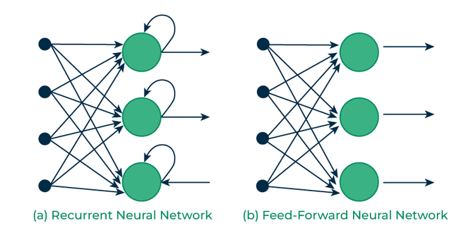

# Introdution to Recurrent Neural Network

Recurrent Neural Networks (RNNs) : RNNs allow the network to “remember” past information by feeding the output from one step into next step.

Think of it like reading a sentence, when you’re trying to predict the next word you don’t just look at the current word but also need to remember the words that came before to make accurate guess.

This image showcases the basic architecture of RNN and the feedback loop mechanism where the output is passed back as input for the next time step.

# How RNN differs from FeedForward Neural Networks

FeedForward Neural Networkds (FNN) : process data in one direction from input to output without retaining information from previous inputs, which makes them suitable for tasks with independent inputs like image classification

**However FNNs struggle with sequential data since they lack memory.**

# Key Components of RNNs

- 1. **Recurrent Unit**
    - a hidden state that maintains information
    - 

- 2. **RNN unfolding**    
    - 在标准的 RNN 结构中，网络的核心是一个共享权重的循环单元，它在每个时间步重复使用相同的参数来处理输入序列

    - RNN unfolding（RNN 展开）是循环神经网络的一种表示方法，用于帮助理解 RNN 的工作原理。RNN 展开将时间序列中的每个时间步单独展开为一个独立的计算单元，从而更直观地展示 RNN 如何处理序列数据。
    - 图像解释：
    
    - 数学解释：
        - 假设我们有一个简单的 RNN 模型，其隐藏状态$h_t$和输出$y_t$的计算公式如下:
        $$
        h_t = \sigma(W_{hh} h_{t-1} + W_{xh} x_t + b_h)
        $$

        $$
        y_t = W_{hy} h_t + b_y
        $$

        其中：

        - $ x_t $ 是第 $ t $ 个时间步的输入。
        - $ h_t $ 是第 $ t $ 个时间步的隐藏状态。
        - $ y_t $ 是第 $ t $ 个时间步的输出。
        - $ W_{hh}$ 是隐藏状态到隐藏状态的权重矩阵。
        - $ W_{xh}$ 输入到隐藏状态的权重矩阵
        - $ W_{hy}$ 隐藏状态到输出的权重矩阵
        - $ b_h, b_y $ 是偏置向量。
        - $ \sigma $ 是激活函数（如 tanh 或 ReLU）。

# Backpropagation Through Time (BPTT)
是一种用于训练循环神经网络（Recurrent Neural Networks, RNNs）的算法，它是标准反向传播算法在时间序列数据上的扩展

BPTT 则是通过展开时间序列来计算梯度的方法

## BPTT 步骤
### 1. **前向传播**

在时间步 $ t $，RNN 的状态更新和输出计算如下：

- 隐藏状态：
  $$
  h_t = f(W_{hh} h_{t-1} + W_{xh} x_t + b_h)
  $$
  其中：
  - $ h_t $ 是第 $ t $ 时间步的隐藏状态。
  - $ W_{hh} $ 是隐藏层到隐藏层的权重矩阵。
  - $ W_{xh} $ 是输入层到隐藏层的权重矩阵。
  - $ b_h $ 是隐藏层的偏置向量。
  - $ f(\cdot) $ 是激活函数（如 tanh 或 ReLU）。

- 输出：
  $$
  y_t = g(W_{hy} h_t + b_y)
  $$
  其中：
  - $ y_t $ 是第 $ t $ 时间步的输出。
  - $ W_{hy} $ 是隐藏层到输出层的权重矩阵。
  - $ b_y $ 是输出层的偏置向量。
  - $ g(\cdot) $ 是输出层的激活函数（如 softmax 或 sigmoid）。

---

### 2. **计算损失**

定义每个时间步的损失函数 $ L_t $（例如交叉熵损失或均方误差），并累积总损失 $ L $：
$$
L = \sum_{t=1}^T L_t
$$
其中：
$$
L_t = \ell(y_t, \hat{y}_t)
$$
$ \ell(\cdot) $ 是具体的损失函数，$ \hat{y}_t $ 是目标值。

---

### 3. **反向传播**

通过链式法则计算梯度。对于参数 $ \theta $（如 $ W_{hh}, W_{xh}, W_{hy} $ 等），其梯度为：
$$
\frac{\partial L}{\partial \theta} = \sum_{t=1}^T \frac{\partial L_t}{\partial \theta}
$$

#### (a) 计算 $ \frac{\partial L_t}{\partial y_t} $

根据损失函数 $ L_t = \ell(y_t, \hat{y}_t) $，计算输出层的梯度：
$$
\frac{\partial L_t}{\partial y_t} = \frac{\partial \ell(y_t, \hat{y}_t)}{\partial y_t}
$$

#### (b) 计算 $ \frac{\partial L_t}{\partial h_t} $

利用链式法则：
$$
\frac{\partial L_t}{\partial h_t} = \frac{\partial L_t}{\partial y_t} \cdot \frac{\partial y_t}{\partial h_t}
$$
其中：
$$
\frac{\partial y_t}{\partial h_t} = W_{hy}^T \cdot g'(W_{hy} h_t + b_y)
$$

#### (c) 计算 $ \frac{\partial L_t}{\partial h_{t-1}} $

由于 $ h_t $ 依赖于 $ h_{t-1} $，需要继续反向传播：
$$
\frac{\partial L_t}{\partial h_{t-1}} = \frac{\partial L_t}{\partial h_t} \cdot \frac{\partial h_t}{\partial h_{t-1}}
$$
其中：
$$
\frac{\partial h_t}{\partial h_{t-1}} = W_{hh}^T \cdot f'(W_{hh} h_{t-1} + W_{xh} x_t + b_h)
$$

#### (d) 计算 $ \frac{\partial L_t}{\partial \theta} $

对于每个参数 $ \theta $，其梯度可以写为：
$$
\frac{\partial L_t}{\partial \theta} = \frac{\partial L_t}{\partial h_t} \cdot \frac{\partial h_t}{\partial \theta}
$$
具体地：
- 对于 $ W_{hh} $:
  $$
  \frac{\partial L_t}{\partial W_{hh}} = \frac{\partial L_t}{\partial h_t} \cdot h_{t-1}^T
  $$
- 对于 $ W_{xh} $:
  $$
  \frac{\partial L_t}{\partial W_{xh}} = \frac{\partial L_t}{\partial h_t} \cdot x_t^T
  $$
- 对于 $ W_{hy} $:
  $$
  \frac{\partial L_t}{\partial W_{hy}} = \frac{\partial L_t}{\partial y_t} \cdot h_t^T
  $$

---

### 4. **参数更新**

使用梯度下降或其他优化算法更新参数。例如，梯度下降的更新规则为：
$$
\theta \leftarrow \theta - \eta \cdot \frac{\partial L}{\partial \theta}
$$
其中 $ \eta $ 是学习率。

---

之后会放一个Excel表格的链接，以充分理解BPTT的过程

# RNN模型的类型

## 1. one-to-one RNN

One-to-One RNN 是一种特殊的循环神经网络（RNN）结构，它在输入和输出之间建立了一对一的映射关系。与标准 RNN 不同的是，**One-to-One RNN 的每个输入只对应一个输出，且没有时间序列上的依赖关系**。这种结构实际上更接近传统的前馈神经网络（Feedforward Neural Network, FNN），但仍然可以利用 RNN 的隐藏状态来捕捉输入数据的某些特性。

---

### One-to-One RNN 的特点

1. **输入和输出数量相同**：
   - 每个输入 $ x_t $ 对应一个输出 $ y_t $，输入和输出是一一对应的。
   - 输入和输出的数量相等，且通常只有一个时间步。

2. **无时间依赖性**：
   - 由于输入和输出之间没有时间序列的关系，隐藏状态 $ h_t $ 并不会从一个时间步传递到下一个时间步。
   - 因此，严格意义上来说，这种结构并不需要“展开”时间维度。

3. **结构类似于前馈神经网络**：
   - One-to-One RNN 的行为与普通的前馈神经网络非常相似，只是可能包含一些 RNN 特有的隐藏层更新机制。

---

### One-to-One RNN 的公式表示

假设输入为 $ x_t $，隐藏状态为 $ h_t $，输出为 $ y_t $，则 One-to-One RNN 的计算过程如下：

1. **隐藏状态更新**：
   $$
   h_t = f(W_{xh} x_t + b_h)
   $$
   其中：
   - $ W_{xh} $ 是输入到隐藏层的权重矩阵。
   - $ b_h $ 是隐藏层的偏置向量。
   - $ f(\cdot) $ 是激活函数（如 tanh 或 ReLU）。

2. **输出计算**：
   $$
   y_t = g(W_{hy} h_t + b_y)
   $$
   其中：
   - $ W_{hy} $ 是隐藏层到输出层的权重矩阵。
   - $ b_y $ 是输出层的偏置向量。
   - $ g(\cdot) $ 是输出层的激活函数（如 softmax 或 sigmoid）。

---

### One-to-One RNN 的应用场景

尽管 One-to-One RNN 在理论上是一个简单的模型，但在实际应用中，它的意义更多体现在以下场景：

1. **作为基础模型**：
   - One-to-One RNN 可以被视为构建更复杂 RNN 结构（如 Many-to-Many 或 Many-to-One）的基础单元。

2. **简单任务**：
   - 如果任务不需要处理时间序列或上下文信息，One-to-One RNN 可以作为一种简单的非线性模型使用。

3. **教学用途**：
   - 在学习 RNN 的过程中，One-to-One RNN 是一个很好的起点，帮助理解 RNN 的基本工作原理。

## 2. one-to-many RNN

### One-to-Many RNN 的特点

1. **单输入**：
   - 网络只接收一个输入 $x$，这个输入可以是一个向量、一个值或者某种形式的编码数据。

2. **多输出**：
   - 网络生成一个输出序列$y_1,y_2,...,y_T$都依赖于之前的隐藏状态和可能的上下文信息。

3. **时间依赖性**：
   - 输出序列中的每个元素都与前一个元素相关联，因为隐藏状态会在时间步之间传递。
4. **应用场景**:
    - One-to-Many RNN 常用于生成任务，例如文本生成、音乐生成、语音合成等。

## 3. Many-to-one RNN

### 应用场景
- 情感分析：输入是一段文本（如一句话或一段评论），输出是一个分类标签（如正面/负面情绪）。
- 语音分类：输入是一段语音信号（如一段录音），输出是一个分类结果（如说话人身份或情绪类别）。
- 视频分类：输入是一系列帧图像（如一段视频），输出是一个分类标签（如视频内容的类别）。
- 时间序列预测：输入是一组时间序列数据（如股票价格的历史记录），输出是一个预测值（如未来的价格趋势）

## 4. Many-to-Many RNN

**Many-to-Many RNN** 是RNN的一种结构形式，其特点是**多个输入对应多个输出**。在这种结构中，网络接收一个输入序列 $ x_1, x_2, \dots, x_T $，并生成一个等长或不同长度的输出序列 $ y_1, y_2, \dots, y_{T'} $。这种结构非常适合处理需要对输入序列进行逐帧映射或翻译的任务。

例如：
- 根据一段语音信号生成对应的文本（语音识别任务）。
- 将一段英文翻译成对应的法文（机器翻译任务）。
---
### Many-to-Many RNN 的特点
1. **多个输入**：
   - 网络接收一个输入序列 $ x_1, x_2, \dots, x_T $，其中每个 $ x_t $ 是时间步 $ t $ 的输入。
2. **多个输出**：
   - 网络生成一个输出序列 $ y_1, y_2, \dots, y_{T'} $，其中每个 $ y_t $ 是时间步 $ t $ 的输出。
   - 输入和输出序列的长度可以相同（同步），也可以不同（异步）。
3. **时间依赖性**：
   - 每个时间步的隐藏状态 $ h_t $ 都会传递到下一个时间步，并且可能影响后续的所有输出。
4. **应用场景**：
   - Many-to-Many RNN 常用于序列到序列的任务，如语音识别、机器翻译、视频标注等。
---
### Many-to-Many RNN 的公式表示
假设输入序列为 $ x_1, x_2, \dots, x_T $，隐藏状态为 $ h_t $，输出序列为 $ y_1, y_2, \dots, y_{T'} $，则 Many-to-Many RNN 的计算过程如下：

#### 1. 隐藏状态更新（时间步 $ t $）
$$
h_t = f(W_{xh} x_t + W_{hh} h_{t-1} + b_h)
$$
其中：
- $ W_{xh} $ 是输入到隐藏层的权重矩阵。
- $ W_{hh} $ 是隐藏层到隐藏层的权重矩阵。
- $ b_h $ 是隐藏层的偏置向量。
- $ f(\cdot) $ 是激活函数（如 tanh 或 ReLU）。

#### 2. 输出计算（时间步 $ t $）
$$
y_t = g(W_{hy} h_t + b_y)
$$
其中：
- $ W_{hy} $ 是隐藏层到输出层的权重矩阵。
- $ b_y $ 是输出层的偏置向量。
- $ g(\cdot) $ 是输出层的激活函数（如 softmax 或 sigmoid）。

#### 注意：
- 如果输入和输出序列长度不同（异步），可以通过额外的机制（如编码器-解码器架构）来调整长度。

---

### Many-to-Many RNN 的应用场景

1. **语音识别**：
   - 输入是一段语音信号（时间序列），输出是对应的文本序列。

2. **机器翻译**：
   - 输入是一段源语言文本（如英文），输出是目标语言文本（如法文）。

3. **视频标注**：
   - 输入是一系列帧图像（如视频片段），输出是对每帧图像的描述或分类标签。

4. **音乐生成**：
   - 输入是一个音乐片段，输出是一个扩展的音乐序列。

5. **手写文字识别**：
   - 输入是一系列笔画轨迹，输出是对应的文本序列。

---

# RNN模型的Variants
## 1. Bidirectional RNNs
Bidirectional RNNs（双向循环神经网络） 是一种特殊的 RNN 结构，它能够同时从两个方向（从前到后和从后到前）处理序列数据。与传统的单向 RNN 不同，双向 RNN 能够在每个时间步利用未来的上下文信息，从而更好地捕捉序列中的全局依赖关系。

### . Bidirectional RNNs 核心思想：
Bidirectional RNN 通过引入两个独立的隐藏层来解决上述问题：

- 前向隐藏层（Forward Layer）：从前向后依次处理序列数据，捕捉过去的上下文信息。
- 后向隐藏层（Backward Layer）：从后向前依次处理序列数据，捕捉未来的上下文信息。

在每个时间步$t$，前向隐藏层和后向隐藏层的输出会被合并（通常是拼接或求和），以生成最终的隐藏状态。

### Bidirectional RNN 的特点
- 全局上下文感知：
    - 每个时间步的隐藏状态不仅包含过去的信息，还包含未来的信息。
    - 这使得模型能够更好地捕捉序列中的长距离依赖关系

- 适合静态序列任务：
    - Bidirectional RNN 适用于静态序列任务（如文本分类、情感分析等），因为在这些任务中，整个序列可以一次性加载到内存中。
    - 但对于实时任务（如语音识别或在线翻译），由于需要等待整个序列完成才能开始反向处理，Bidirectional RNN 并不适用。
- 增加计算复杂度：
    - 引入了两个独立的隐藏层，导致参数数量和计算成本翻倍。

## 2. Long Short-Term Memory Networks, LSTMs

## 3. Gated Recurrent Units, GRUs

